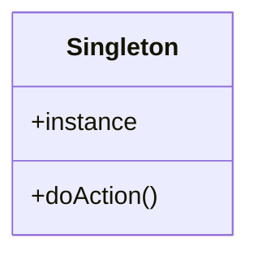
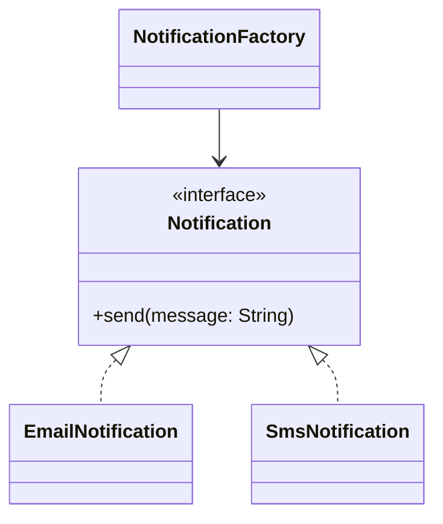
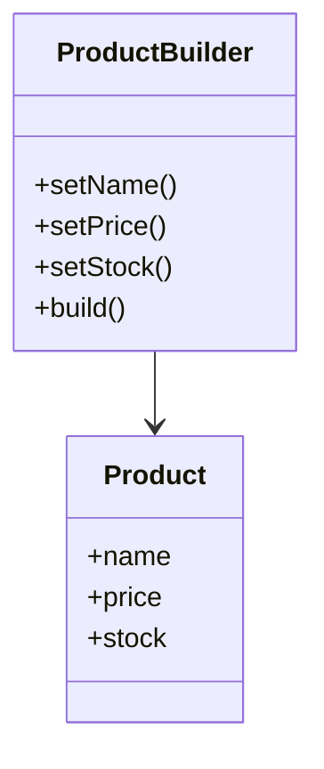
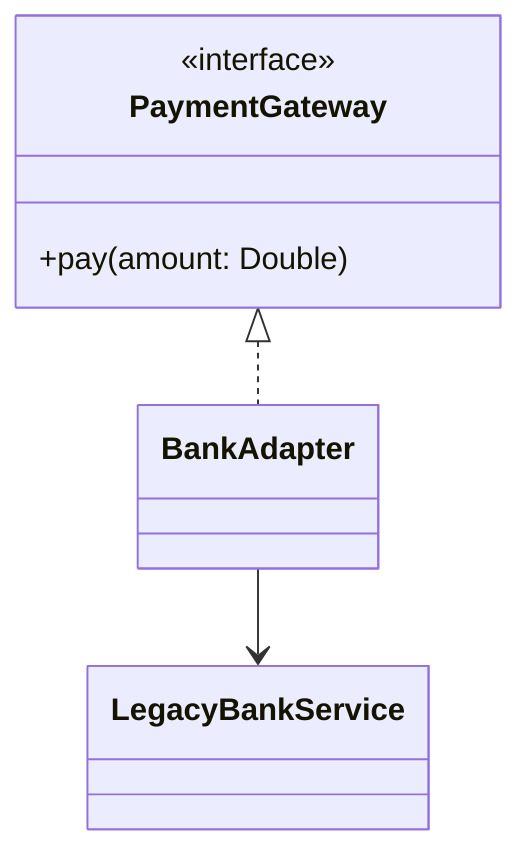
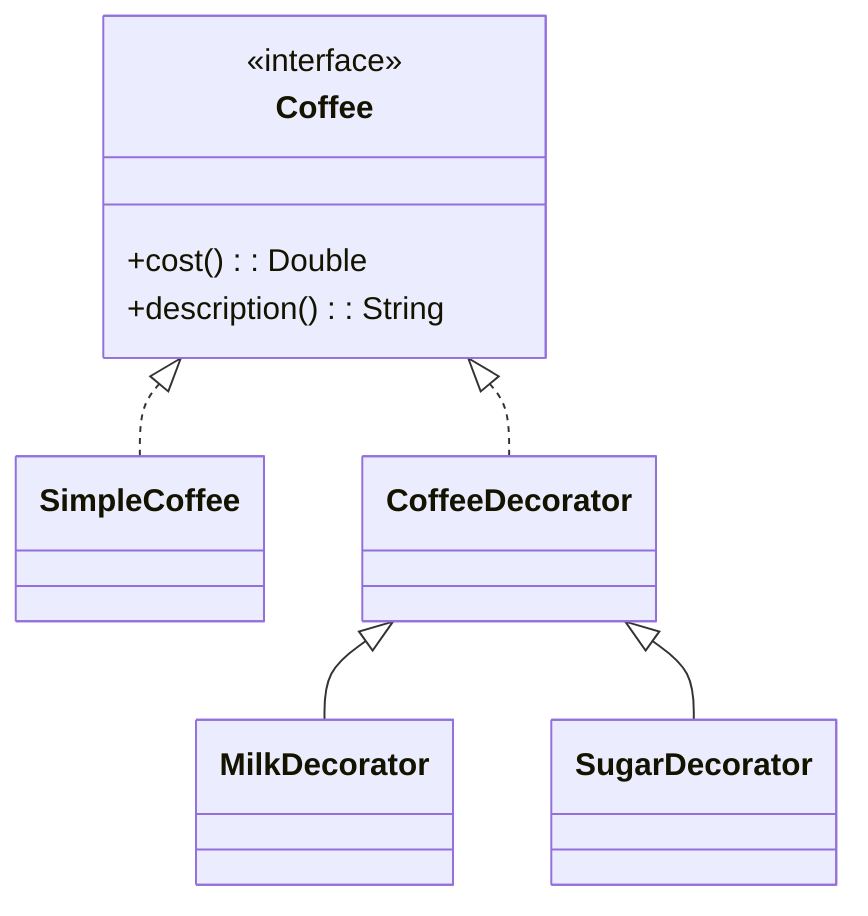
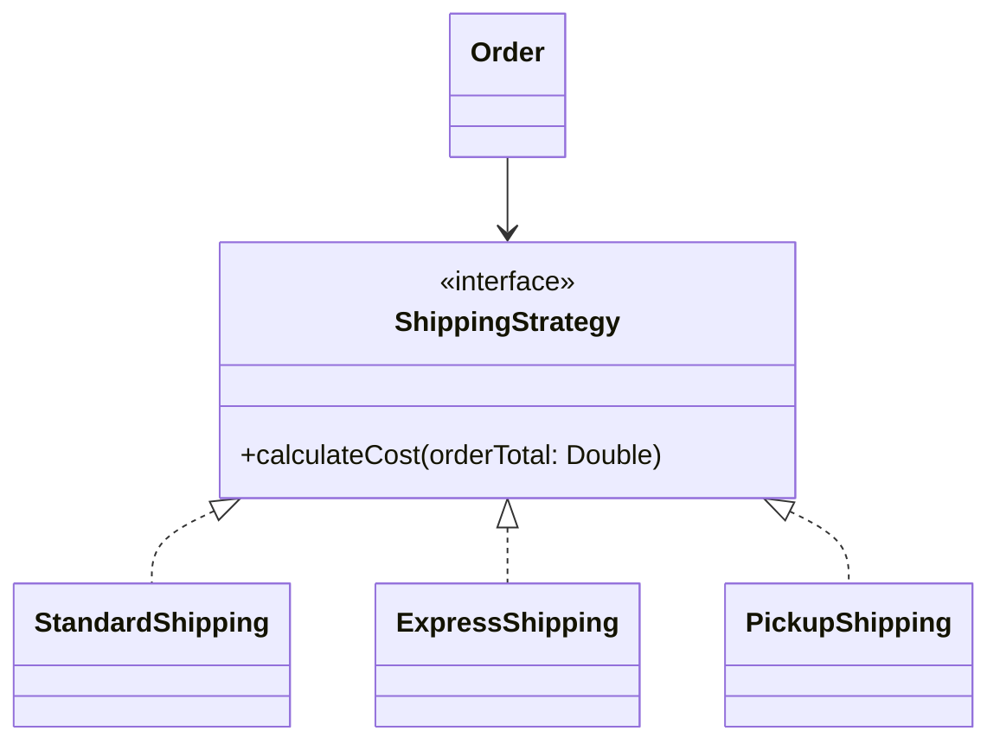
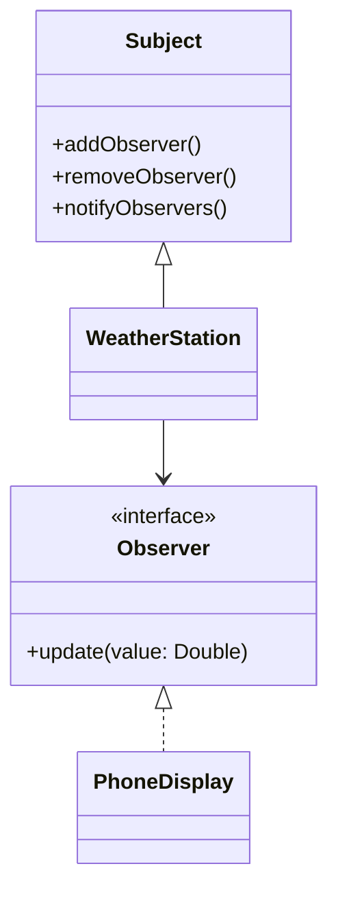
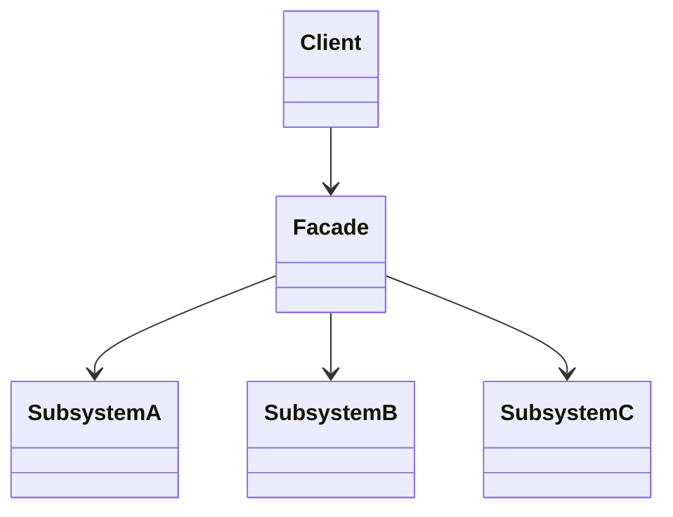
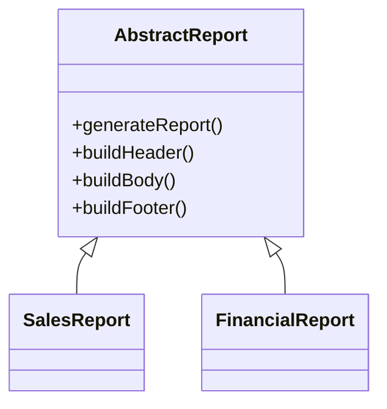

<<<<<<< Updated upstream
# Estudo de Design Patterns

Repositório dedicado ao estudo prático de Padrões de Projeto (Design Patterns). O objetivo é registrar anotações, exemplos de código e entender as melhores práticas para criar softwares flexíveis, reutilizáveis e fáceis de manter.

---

## Progresso dos Estudos

### Criacionais
- [ ] Singleton
- [ ] Factory Method
- [ ] Abstract Factory
- [ ] Builder
- [ ] Prototype

### Estruturais
- [ ] Adapter
- [ ] Bridge
- [ ] Composite
- [ ] Decorator
- [ ] Facade
- [ ] Flyweight
- [ ] Proxy

### Comportamentais
- [ ] Chain of Responsibility
- [ ] Command
- [ ] Iterator
- [ ] Mediator
- [ ] Memento
- [ ] Observer
- [ ] State
- [ ] Strategy
- [ ] Template Method
- [ ] Visitor

---

## Stack e Organização

* Linguagem: [Sua Linguagem Aqui]
* Estrutura de Pastas: Cada padrão possui uma pasta com um exemplo prático (/antes e /depois) e um resumo rápido do problema que ele resolve.
=======
# Design Patterns em Kotlin

Este repositório reúne exemplos práticos de padrões de projeto (Design Patterns) em Kotlin, com foco em clareza, documentação e contexto de uso. Os exemplos são pensados para serem didáticos e fáceis de entender em projetos reais.

## Objetivo

Os padrões de projeto ajudam a resolver problemas recorrentes no desenvolvimento de software:

- reduzir acoplamento;
- aumentar reutilização;
- facilitar manutenção;
- deixar o código mais legível;
- separar responsabilidades.

---

## Como estudar este repositório

Cada padrão abaixo traz:

- problema que resolve;
- contexto em que é útil;
- diagrama conceitual;
- exemplo em Kotlin;
- comentários explicativos;
- quando usar e quando evitar.

---

## 1) Singleton

### Problema
Quando precisamos garantir que exista apenas uma instância de uma classe e que ela seja acessível globalmente.

### Contexto de uso
- gerenciador de configuração;
- conexão com banco de dados;
- logger centralizado.

### Diagrama



### Exemplo em Kotlin

```kotlin
object DatabaseConfig {
    val url = "jdbc:postgresql://localhost:5432/app"
    fun connect() = println("Conectado ao banco")
}
```

### Quando usar
Use quando a aplicação precisa de uma única fonte de verdade.

### Quando evitar
Evite em classes com estado altamente mutável ou em componentes que precisem ser testados isoladamente.

---

## 2) Factory Method

### Problema
Queremos criar objetos sem acoplar o código cliente à classe concreta que será instanciada.

### Contexto de uso
- criação de notificações;
- carregamento de diferentes tipos de arquivos;
- seleção de estratégia por tipo.

### Diagrama



### Exemplo em Kotlin

```kotlin
interface Notification {
    fun send(message: String)
}

class EmailNotification : Notification {
    override fun send(message: String) = println("Email: $message")
}

class SmsNotification : Notification {
    override fun send(message: String) = println("SMS: $message")
}

class NotificationFactory {
    fun create(type: String): Notification = when (type.lowercase()) {
        "email" -> EmailNotification()
        "sms" -> SmsNotification()
        else -> throw IllegalArgumentException("Tipo inválido")
    }
}
```

### Quando usar
Use quando a criação do objeto depende de condições ou tipos diferentes.

---

## 3) Builder

### Problema
Objetos complexos com muitos atributos ficam difíceis de construir por construtores longos.

### Contexto de uso
- configuração de pedidos;
- criação de objetos com muitas opções;
- objetos imutáveis.

### Diagrama



### Exemplo em Kotlin

```kotlin
data class House(
    val walls: Int,
    val doors: Int,
    val windows: Int,
    val garage: Boolean,
    val roof: String
)

class HouseBuilder {
    private var walls = 0
    private var doors = 0
    private var windows = 0
    private var garage = false
    private var roof = "Telha"

    fun setWalls(value: Int) = apply { walls = value }
    fun setDoors(value: Int) = apply { doors = value }
    fun setWindows(value: Int) = apply { windows = value }
    fun setGarage(value: Boolean) = apply { garage = value }
    fun setRoof(value: String) = apply { roof = value }

    fun build() = House(walls, doors, windows, garage, roof)
}
```

### Quando usar
Use quando a construção do objeto envolve muitas etapas e combinações possíveis.

---

## 4) Adapter

### Problema
Uma classe existente precisa ser usada em um sistema que espera outra interface.

### Contexto de uso
- integrações com bibliotecas legadas;
- conversão de APIs externas;
- compatibilidade com sistemas antigos.

### Diagrama



### Exemplo em Kotlin

```kotlin
interface PaymentGateway {
    fun pay(amount: Double): String
}

class LegacyBankService {
    fun transfer(value: Double): String = "Transferência de R$ $value"
}

class BankAdapter(private val legacyBankService: LegacyBankService) : PaymentGateway {
    override fun pay(amount: Double): String = legacyBankService.transfer(amount)
}
```

### Quando usar
Use quando você precisa reutilizar uma implementação antiga sem reescrever todo o sistema.

---

## 5) Decorator

### Problema
Queremos adicionar comportamento novo a objetos sem alterar a classe original.

### Contexto de uso
- café com leite e açúcar;
- autenticação em camadas;
- validação em fluxos de pipeline.

### Diagrama



### Exemplo em Kotlin

```kotlin
interface Coffee {
    fun cost(): Double
    fun description(): String
}

class SimpleCoffee : Coffee {
    override fun cost() = 5.0
    override fun description() = "Café simples"
}

abstract class CoffeeDecorator(private val base: Coffee) : Coffee {
    override fun cost() = base.cost()
    override fun description() = base.description()
}

class MilkDecorator(base: Coffee) : CoffeeDecorator(base) {
    override fun cost() = base.cost() + 2.0
    override fun description() = "${base.description()} com leite"
}

class SugarDecorator(base: Coffee) : CoffeeDecorator(base) {
    override fun cost() = base.cost() + 1.0
    override fun description() = "${base.description()} com açúcar"
}
```

### Quando usar
Use quando o comportamento precisa ser combinado dinamicamente.

---

## 6) Strategy

### Problema
A lógica de um algoritmo precisa variar de acordo com o contexto, sem mudar a interface do cliente.

### Contexto de uso
- cálculo de frete;
- algoritmos de ordenação;
- regras de pagamento.

### Diagrama



### Exemplo em Kotlin

```kotlin
interface ShippingStrategy {
    fun calculateCost(orderTotal: Double): Double
}

class StandardShipping : ShippingStrategy {
    override fun calculateCost(orderTotal: Double) = 15.0
}

class ExpressShipping : ShippingStrategy {
    override fun calculateCost(orderTotal: Double) = 30.0
}

class PickupShipping : ShippingStrategy {
    override fun calculateCost(orderTotal: Double) = 0.0
}

class Order(private val shippingStrategy: ShippingStrategy) {
    fun totalWithShipping(orderTotal: Double): Double = orderTotal + shippingStrategy.calculateCost(orderTotal)
}
```

### Quando usar
Quando o comportamento muda de acordo com a regra de negócio ou tipo de operação.

---

## 7) Observer

### Problema
Quando um objeto precisa avisar vários interessados sobre mudanças de estado.

### Contexto de uso
- painel de temperatura;
- notificações de eventos;
- feeds em tempo real.

### Diagrama



### Exemplo em Kotlin

```kotlin
interface Observer {
    fun update(temperature: Double)
}

class WeatherStation {
    private val observers = mutableListOf<Observer>()

    fun addObserver(observer: Observer) {
        observers.add(observer)
    }

    fun removeObserver(observer: Observer) {
        observers.remove(observer)
    }

    fun setTemperature(temperature: Double) {
        observers.forEach { it.update(temperature) }
    }
}

class PhoneDisplay : Observer {
    override fun update(temperature: Double) {
        println("Display do celular: temperatura atual = $temperature°C")
    }
}
```

### Quando usar
Use quando há dependência entre um objeto e vários consumidores que precisam reagir às mudanças.

---

## 8) Facade

### Problema
Um sistema complexo tem muitos subsistemas e o código cliente precisa conhecer detalhes internos desnecessários.

### Contexto de uso
- bibliotecas de conversão de mídia;
- integrações com APIs pesadas;
- serviços com múltiplos passos.

### Diagrama



### Exemplo em Kotlin

```kotlin
class VideoFile(val name: String)

class CodecFactory {
    fun extract(file: VideoFile): String = "Codec do arquivo ${file.name}"
}

class BitrateReader {
    fun read(file: VideoFile, codec: String): String = "Leitura do vídeo: $codec"
}

class AudioMixer {
    fun mix(input: String): String = "Áudio misturado: $input"
}

class VideoConverterFacade {
    fun convert(videoName: String): String {
        val file = VideoFile(videoName)
        val codec = CodecFactory().extract(file)
        val buffer = BitrateReader().read(file, codec)
        return AudioMixer().mix(buffer)
    }
}
```

### Quando usar
Use quando o cliente precisa de uma interface simples para tarefas complexas.

---

## 9) Template Method

### Problema
Queremos padronizar uma sequência de passos, embora alguns detalhes variem conforme a subclasse.

### Contexto de uso
- geração de relatórios;
- processamento de documentos;
- fluxo de autorização.

### Diagrama



### Exemplo em Kotlin

```kotlin
abstract class ReportGenerator {
    fun generateReport(): String {
        return buildHeader() + buildBody() + buildFooter()
    }

    protected abstract fun buildHeader(): String
    protected abstract fun buildBody(): String
    protected abstract fun buildFooter(): String
}

class SalesReport : ReportGenerator() {
    override fun buildHeader() = "Relatório de Vendas\n"
    override fun buildBody() = "- Produto A: 100\n- Produto B: 80\n"
    override fun buildFooter() = "Total: 180\n"
}
```

### Quando usar
Quando várias classes executam a mesma sequência de passos, mas com pequenas variações.

---

## Resumo rápido

| Padrão | Categoria | Uso principal |
|---|---|---|
| Singleton | Criacional | Garantir uma instância global |
| Factory Method | Criacional | Criar objetos por tipo |
| Builder | Criacional | Construir objetos complexos |
| Adapter | Estrutural | Adaptar interfaces incompatíveis |
| Decorator | Estrutural | Adicionar comportamento dinamicamente |
| Strategy | Comportamental | Trocar algoritmos em tempo de execução |
| Observer | Comportamental | Notificar mudanças para vários interessados |
| Facade | Estrutural | Simplificar o uso de subsistemas complexos |
| Template Method | Comportamental | Definir passos fixos com variações |

---

## Dica de estudo

Ao aprender Design Patterns, não pense apenas no código, mas também em:

1. qual problema está sendo resolvido;
2. qual é o trade-off;
3. quando esse padrão é útil;
4. quando ele pode complicar o sistema.

O melhor padrão não é o mais sofisticado, e sim o mais adequado ao problema.

---

## Como executar os exemplos

No terminal, a partir da raiz do projeto:

```bash
kotlinc main.kt -include-runtime -d app.jar
java -jar app.jar
```

A saída demonstra vários padrões em execução.
>>>>>>> Stashed changes
